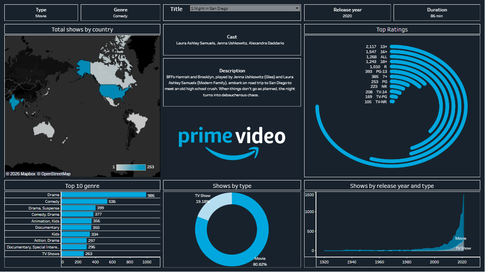

# Amazon Prime Video Content Analysis Dashboard


***📌 Project Snapshot***

**Project Title:** Amazon Prime Video Content Analysis Dashboard <br>
**Domain / Business Function:** OTT Analytics | Media & Entertainment | Business Intelligence<br>
**Tools & Technologies:**  Tableau (Calculated Fields, Parameters, Filters, Dashboard Actions), CSV (Data Cleaning & Preprocessing)<br>
**Analytical Focus:** <br>
Genre Popularity Analysis, Regional Content Distribution, Content Growth Over Time, Rating-Based Audience Targeting, Content Type Comparison (Movies vs TV Shows)<br>
**Business Objective:** To transform raw Amazon Prime Video content metadata into interactive visual insights that help understand content distribution, growth trends, and strategic focus areas for OTT platforms.<br>

<p align="left">
  <a href= "https://www.linkedin.com/in/nambhidharan-s/" target="_blank">
    
  </a>
</p>


## 🚀 Introduction

This project was created with the intention of gaining **hands-on experience in Tableau** and understanding **OTT platform content analysis**.
The dashboard was developed by following a **step-by-step guided tutorial**, focusing on learning practical Tableau techniques such as calculated fields, filters, joins, and interactive dashboard design.

The goal of this project is not only to replicate a dashboard, but to **understand the analytical thinking, visualization logic, and business interpretation** behind OTT content analytics.

📌 **Learning-focused project built by following an educational resource (credits provided in Resources section).**

<p align="left">
  <a href= "https://www.linkedin.com/in/nambhidharan-s/" target="_blank">
    
  </a>
</p>

## 🎯 Business Problem

OTT platforms like Amazon Prime Video manage thousands of titles across multiple regions and audience segments. Without structured analytics, it is difficult to:

* Identify dominant genres and content gaps
* Understand regional content distribution
* Analyze content growth trends over time
* Target content effectively by age rating

<p align="left">
  <a href= "https://www.linkedin.com/in/nambhidharan-s/" target="_blank">
    
  </a>
</p>

## ❓ Key Question

**How can Amazon Prime Video’s content metadata be transformed into actionable insights using data visualization and interactive analytics?**

<p align="left">
  <a href= "https://www.linkedin.com/in/nambhidharan-s/" target="_blank">
    
  </a>
</p>

## 🧩 Project Scope

### ✔ Included

* Analysis of Amazon Prime Video movies and TV shows
* Interactive Tableau dashboard with dropdown filters
* Country, genre, year, rating, and content-type analysis
* KPI-driven insights for content strategy

### ❌ Excluded

* User watch behavior or engagement data
* Revenue or subscription analytics
* Machine learning or recommendation systems

<p align="left">
  <a href= "https://www.linkedin.com/in/nambhidharan-s/" target="_blank">
    
  </a>
</p>

## 📂 Dataset Overview

### 🔹 Dataset Summary

* **Platform:** Amazon Prime Video
* **Records:** ~10,000 Movies & TV Shows
* **Time Period:** Up to mid-2021
* **Format:** Tabular (CSV)

### 🔹 Dataset Attributes

* Title
* Type (Movie / TV Show)
* Genre
* Cast & Director
* Country
* Release Year
* Duration
* Content Rating
* Description

### 🔹 Data Source

**About this Dataset:**
Amazon Prime is one of the most popular media and video streaming platforms, with close to **10,000 movies and TV shows** available as of mid-2021 and over **200 million subscribers globally**.
This dataset contains detailed listings of all movies and TV shows available on Amazon Prime, including cast, directors, ratings, release year, duration, and more.

📎 **Source:** Kaggle
🔗 [https://www.kaggle.com/datasets/shivamb/amazon-prime-movies-and-tv-shows](https://www.kaggle.com/datasets/shivamb/amazon-prime-movies-and-tv-shows)

<p align="left">
  <a href= "https://www.linkedin.com/in/nambhidharan-s/" target="_blank">
    
  </a>
</p>

## ⚙️ Tools & Technologies

* **Tableau:** Interactive dashboards and visual analytics
* **Calculated Fields:** KPI calculations and derived metrics
* **Filters & Parameters:** Dropdown-based interactivity
* **Excel / CSV:** Data cleaning and preprocessing

<p align="left">
  <a href= "https://www.linkedin.com/in/nambhidharan-s/" target="_blank">
    
  </a>
</p>

## 🧠 Methodology

### 1️⃣ Data Loading

* Imported Amazon Prime Video dataset (CSV format) into Tableau
* Connected an additional helper file (`Radial Bar chart values.txt`) for custom chart creation

<p align="left">
  <a href= "https://www.linkedin.com/in/nambhidharan-s/" target="_blank">
    
  </a>
</p>

### 2️⃣ Data Cleaning & Preparation

* Filtered out null and invalid values across all dimensions
* Standardized categorical fields such as Genre, Country, and Content Rating
* Ensured consistency for accurate aggregation and visualization

<p align="left">
  <a href= "https://www.linkedin.com/in/nambhidharan-s/" target="_blank">
    
  </a>
</p>

### 3️⃣ Data Analysis

#### 🔄 Radial Bar Chart – Top Ratings (Advanced Tableau Technique)

To create a **custom radial bar chart** for top content ratings:

* A helper file **`Radial Bar chart values.txt`** containing values `0` and `270` was used
* Joined with the main dataset using a **1-to-1 join**

**Calculated Measures Created:**

1. `My_Index = INDEX() - 1`
2. `Total Rating = COUNTD([Title])`
3. `My_total = WINDOW_MAX([Total Rating])`
4. `My_rank = RANK_UNIQUE([My_total], 'asc')`
5. `My_total_max = WINDOW_MAX([Total Rating])`
6. `Percentage = [My_total] / [My_total_max]`

**Radial Chart Coordinates:**

* **X-axis:**

  ```
  COS(RADIANS([My_Index] * [Percentage])) * [My_rank]
  ```
* **Y-axis:**

  ```
  SIN(RADIANS([My_Index] * [Percentage])) * [My_rank]
  ```

This approach enabled the creation of a visually appealing and informative **radial representation of rating distribution**.

<p align="left">
  <a href= "https://www.linkedin.com/in/nambhidharan-s/" target="_blank">
    
  </a>
</p>

### 4️⃣ Data Visualization

* Designed each visual with a **clear analytical purpose**
* Implemented interactive filters for country, genre, year, rating, and content type
* Built KPI-driven visuals to support business interpretation

<p align="left">
  <a href= "https://www.linkedin.com/in/nambhidharan-s/" target="_blank">
    
  </a>
</p>

## 🔍 Dashboard Features

### 🔽 Interactive Title Selector

A dropdown filter allows users to select a specific title (e.g., *“2.0”*). Upon selection, the dashboard dynamically displays:

* Cast
* Description
* Release Year
* Duration
* Genre
* Content Type (Movie / TV Show)

📌 Simulates a real-world OTT content exploration experience to try [click here](https://public.tableau.com/app/profile/nambhidharan.s/viz/AmazonPrime_17672783550780/Dashboard1).

<p align="left">
  <a href= "https://www.linkedin.com/in/nambhidharan-s/" target="_blank">
    
  </a>
</p>

## 📈 Key Visual Insights

### 🌍 Total Shows by Country

* **United States:** 253 titles
* **India:** 229 titles

**Insight:** These two countries dominate Prime Video’s content library.

<p align="left">
  <a href= "https://www.linkedin.com/in/nambhidharan-s/" target="_blank">
    
  </a>
</p>

### 🎭 Top 10 Genres

| Genre                          | Number of Titles |
| ------------------------------ | ---------------- |
| Drama                          | 986              |
| Comedy                         | 536              |
| Drama + Suspense               | 399              |
| Comedy + Drama                 | 377              |
| Animation + Kids               | 356              |
| Documentary                    | 350              |
| Kids                           | 334              |
| Action + Drama                 | 297              |
| Documentary + Special Interest | 296              |
| TV Shows                       | 263              |

**Insight:** Drama and Comedy-led genres form the core of Prime Video’s content strategy.

<p align="left">
  <a href= "https://www.linkedin.com/in/nambhidharan-s/" target="_blank">
    
  </a>
</p>

### 🎬 Content Type Distribution

* **Movies:** 80.82%
* **TV Shows:** 19.18%

**Insight:** Prime Video is movie-heavy, with steady growth in TV shows.

<p align="left">
  <a href= "https://www.linkedin.com/in/nambhidharan-s/" target="_blank">
    
  </a>
</p>

### 📅 Content Growth by Release Year

* Timeline: **1920 – 2021**
* Peak in **2021**

  * Movies: 1,139
  * TV Shows: 303

**Insight:** Aggressive content expansion in recent years.

<p align="left">
  <a href= "https://www.linkedin.com/in/nambhidharan-s/" target="_blank">
    
  </a>
</p>

### 🔞 Content Rating Distribution

* **13+:** 2,117 titles
* **16+:** 1,547 titles

**Insight:** The platform strongly targets teen and young adult audiences.

<p align="left">
  <a href= "https://www.linkedin.com/in/nambhidharan-s/" target="_blank">
    
  </a>
</p>

## 📊 Key KPIs

* Total number of titles
* Movies vs TV Shows ratio
* Genre-wise content count
* Country-wise content distribution
* Year-wise content growth
* Rating-based audience targeting


<p align="left">
  <a href= "https://www.linkedin.com/in/nambhidharan-s/" target="_blank">
    
  </a>
</p>


## 🖼️ Screenshots

**Dashboard Overview**

<p>
  <a href="https://public.tableau.com/app/profile/nambhidharan.s/viz/AmazonPrime_17672783550780/Dashboard1">
  
  </a>
</p>


**Genre Analysis View**

<p align= 'center'>
  <a href="https://public.tableau.com/app/profile/nambhidharan.s/viz/AmazonPrime_17672783550780/Dashboard1">
  
  </a>
</p>

**Country Map Visualization**

<div align= "center">
  <a href="https://public.tableau.com/app/profile/nambhidharan.s/viz/AmazonPrime_17672783550780/Dashboard1">
  
  </a>
</div>

**Year-wise Content Growth**

<div align= "center">
  <a href="https://public.tableau.com/app/profile/nambhidharan.s/viz/AmazonPrime_17672783550780/Dashboard1">
  
  </a>
</div>

**Title Dropdown Interaction**

<div align= "center">
  <a href="https://public.tableau.com/app/profile/nambhidharan.s/viz/AmazonPrime_17672783550780/Dashboard1">
  
  </a>
</div>

<p align="left">
  <a href= "https://www.linkedin.com/in/nambhidharan-s/" target="_blank">
    
  </a>
</p>


## 💡 Key Business Takeaways

* Drama & Comedy dominate content investment
* US and India are major content contributors
* Teen and young adult audiences are primary targets
* Content production accelerated significantly post-2018

<p align="left">
  <a href= "https://www.linkedin.com/in/nambhidharan-s/" target="_blank">
    
  </a>
</p>

## 🏁 Conclusion

This project demonstrates how **Tableau-powered analytics** can convert raw OTT platform data into meaningful business insights.
It highlights skills in **data visualization, KPI design, calculated fields, and interactive dashboard development**, making it well-suited for **Data Analyst / Business Analyst** portfolios.

<p align="left">
  <a href= "https://www.linkedin.com/in/nambhidharan-s/" target="_blank">
    
  </a>
</p>

## 📁 Folder Structure:

```
Amazon-Prime-Video-Content-Analysis-Dashboard/
│
├── Dashboard/
│   └── Amazon Prime.twbx
│
├── Dataset/
│   ├── amazon_prime_titles.csv
│   └── Radial Bar chart values.txt
│
├── Image/
│   ├── Dashboard.png
│   ├── Prime video logo.png
│   ├── Show by Release Year and Type.png
│   ├── Shows by Type.png
│   ├── Top 10 Genre.png
│   ├── Total Ratings.png
│   └── Total Show by Country.png
│
└── Readme.md
```

<p align="left">
  <a href= "https://www.linkedin.com/in/nambhidharan-s/" target="_blank">
    
  </a>
</p>

## 📚 Resources & Credits

* **YouTube Channel:** DataScience RoadMap
  🔗 [https://www.youtube.com/@DataScienceRoadMap](https://www.youtube.com/@DataScienceRoadMap)

* **Tutorial Video:**
  *Create an Amazing Dashboard Using Tableau in 26 Minutes | Amazon Prime Video*
  🔗 [https://youtu.be/ZFndp6d47uo?si=FPERTxkkg6DjpGFW](https://youtu.be/ZFndp6d47uo?si=FPERTxkkg6DjpGFW)

* **GitHub Repository (Dataset & Assets):**
  🔗 [https://github.com/DataScienceRoadMapDSRM/Tableau-Dashboards-info](https://github.com/DataScienceRoadMapDSRM/Tableau-Dashboards-info)


